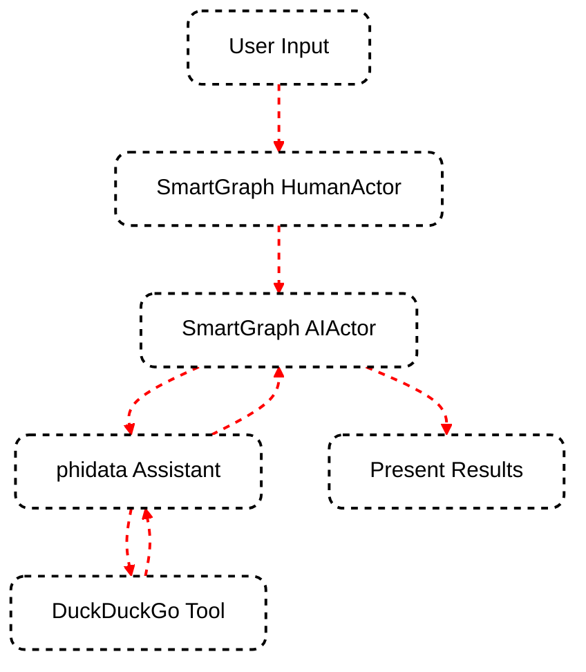

SmartGraph's power is amplified when combined with AI assistants. By leveraging the phidata (phi) library, you can create sophisticated AI-driven applications that can perform a wide range of tasks.

## What is phidata?

Phidata is a framework for building **AI Assistants** with memory, knowledge, and tools. It allows you to turn any Large Language Model (LLM) into an AI Assistant that can:

- Search the web
- Pull data from APIs
- Analyze data using SQL, DuckDb, etc.
- Conduct research and generate reports
- Answer questions from PDFs, APIs, etc.
- Summarize articles, videos, etc.
- Perform tasks like sending emails, querying databases, etc.

## Integrating phidata with SmartGraph

SmartGraph's `AIActor` class is designed to work seamlessly with phidata's `Assistant` class. Here's how you can integrate them:

<Steps>
  <Step title="Install phidata">
    First, install phidata in your project environment:

    ```bash
    pip install -U phidata
    ```

  </Step>
  <Step title="Create a phidata Assistant">
    Create a phidata Assistant with the desired capabilities:

    ```python
    from phi.assistant import Assistant
    from phi.tools.duckduckgo import DuckDuckGo

    phi_assistant = Assistant(tools=[DuckDuckGo()], show_tool_calls=True)
    ```

  </Step>
  <Step title="Create an AIActor with the phidata Assistant">
    Use the phidata Assistant to create a SmartGraph AIActor:

    ```python
    from smartgraph import AIActor

    ai_actor = AIActor("AI Research Assistant", assistant=phi_assistant)
    ```

  </Step>
  <Step title="Use the AIActor in your SmartGraph">
    Now you can use this AIActor in your SmartGraph nodes:

    ```python
    from smartgraph import Node, Task

    research_node = Node(
        id="research",
        actor=ai_actor,
        task=Task(description="Conduct web research", prompt="Research the latest developments in AI")
    )
    ```

  </Step>
</Steps>

## Example: Web Research Assistant

Let's create a simple SmartGraph application that uses a phidata-powered AI assistant to conduct web research:

```python
from smartgraph import SmartGraph, Node, Edge, HumanActor, AIActor, Task
from phi.assistant import Assistant
from phi.tools.duckduckgo import DuckDuckGo

# Create phidata Assistant
phi_assistant = Assistant(tools=[DuckDuckGo()], show_tool_calls=True)

# Create SmartGraph actors
human = HumanActor("User")
ai = AIActor("AI Researcher", assistant=phi_assistant)

# Create nodes
start_node = Node(id="start", actor=human, task=Task(description="Get research topic"))
research_node = Node(id="research", actor=ai, task=Task(description="Conduct web research"))
present_node = Node(id="present", actor=ai, task=Task(description="Present research findings"))

# Create graph
graph = SmartGraph()
graph.add_node(start_node)
graph.add_node(research_node)
graph.add_node(present_node)

# Add edges
graph.add_edge(Edge(source_id="start", target_id="research"))
graph.add_edge(Edge(source_id="research", target_id="present"))

# Execute the graph
final_output, should_exit = graph.execute("start", {}, "research_session")
print("Research findings:", final_output)
```

This example creates a simple research workflow where:

1. The user provides a research topic
2. The AI assistant conducts web research using DuckDuckGo
3. The AI assistant presents the research findings

## Visualizing the AI-Enhanced Workflow

Here's a diagram illustrating how phidata integrates with SmartGraph:



This diagram shows how user input flows through SmartGraph actors, into the phidata Assistant, which then uses tools like DuckDuckGo to perform tasks before returning results back through the SmartGraph workflow.

## Conclusion

By integrating phidata with SmartGraph, you can create powerful, AI-driven applications that combine the structured workflow management of SmartGraph with the advanced capabilities of AI assistants. This combination allows for the creation of complex, intelligent systems capable of performing a wide range of tasks autonomously.

<Card title="Next Steps" icon="arrow-right" href="/essentials/custom-actors">
  Learn how to create custom actors and actions to further extend your
  SmartGraph applications in the [Custom Actors and
  Actions](/essentials/custom-actors) guide.
</Card>
