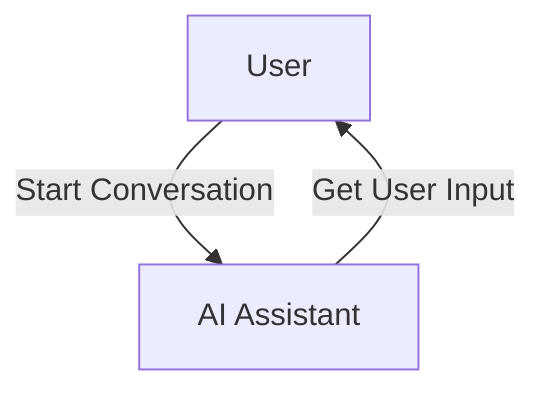

## 1. Actors: The Doers

Actors represent the entities that perform actions within your SmartGraph application. They are the "doers" in your workflow, responsible for executing tasks and driving the application logic.

SmartGraph provides three primary types of actors:

- **HumanActor:** Represents a human user interacting with the application. Typically, a `HumanActor` will receive instructions or prompts and provide input through the console.
- **AIActor:** Represents an AI agent powered by an LLM. This actor can process information, generate responses, and make decisions based on its training and the context of the workflow.
- **FunctionActor:** (You'll likely want to add this actor in your future development) Represents a Python function. This allows you to integrate arbitrary Python code into your SmartGraph, enabling you to perform tasks such as calculations, data manipulation, or interactions with external APIs.

**Example:**

```python
from smartgraph import HumanActor, AIActor

human = HumanActor("User")
ai_assistant = AIActor("AI Assistant")
```

## 2. Tasks: The Actions

Tasks define the specific actions that actors perform. They encapsulate the instructions or prompts that guide an actor's behavior. A `Task` object contains:

- `description`: A brief, human-readable description of the task.
- `prompt`: (Optional) A more detailed prompt that provides instructions or context to the actor. The `prompt` can be a template string that includes dynamic values from the workflow state or input data.

**Example:**

```python
from smartgraph import Task

greet_task = Task(description="Greet the user", prompt="Hello there! What can I help you with today?")
analyze_data_task = Task(description="Analyze user data")
```

## 3. Nodes: The Steps

Nodes are the building blocks of your SmartGraph. They represent individual steps or stages within the workflow. Each node is associated with an `actor` and a `task`, defining who is responsible for performing the action and what action they will take.

**Example:**

```python
from smartgraph import Node

greet_node = Node(id="greet_user", actor=ai_assistant, task=greet_task)
analyze_node = Node(id="analyze_data", actor=ai_assistant, task=analyze_data_task)
```

## 4. Edges: The Connections

Edges define the transitions between nodes, establishing the flow of execution in your SmartGraph. They determine how the workflow progresses from one step to the next.

Edges can have optional conditions to control the flow based on the application state or input data. This allows you to create dynamic workflows with branching logic.

**Example:**

```python
from smartgraph import Edge

edge1 = Edge(source_id="greet_user", target_id="analyze_data")  # Simple transition
edge2 = Edge(source_id="node_A", target_id="node_B",
             condition=lambda data: data['user_response'] == 'yes') # Conditional transition
```

## How These Components Work Together

1. **Execution starts at a specific node:** You initiate the workflow by calling `graph.execute()` and specifying the starting node ID.

2. **The node's actor performs the task:** The actor associated with the current node executes its assigned task. This might involve getting user input (for `HumanActor`), running an LLM (for `AIActor`), or executing a Python function (for `FunctionActor`).

3. **Output data is generated:** The actor's task execution may produce output data.

4. **Edges determine the next node:** Based on the outgoing edges from the current node and their conditions, SmartGraph determines the next node to execute.

5. **The process repeats:** Steps 2-4 continue until a node with no valid outgoing edges is reached or an explicit exit condition is met.

## Choosing the Right Actors

- **HumanActor:** Use when you need direct input or feedback from a human user.
- **AIActor:** Ideal for tasks involving natural language understanding, generation, reasoning, or decision-making.
- **FunctionActor:** Use to integrate custom Python logic into your workflow, including interactions with external systems.

## Diagram

A simple diagram illustrating these concepts:



In this diagram:

- The **actors** are "HumanActor: User" and "AIActor: AI Assistant".
- The **task** performed by the AI Assistant is "Get User Input".
- The **nodes** are represented by the boxes containing the actors.
- The **edges** are the arrows indicating the flow of the conversation.

By combining these core elements, you can build flexible and intelligent applications that leverage the power of LLMs.
