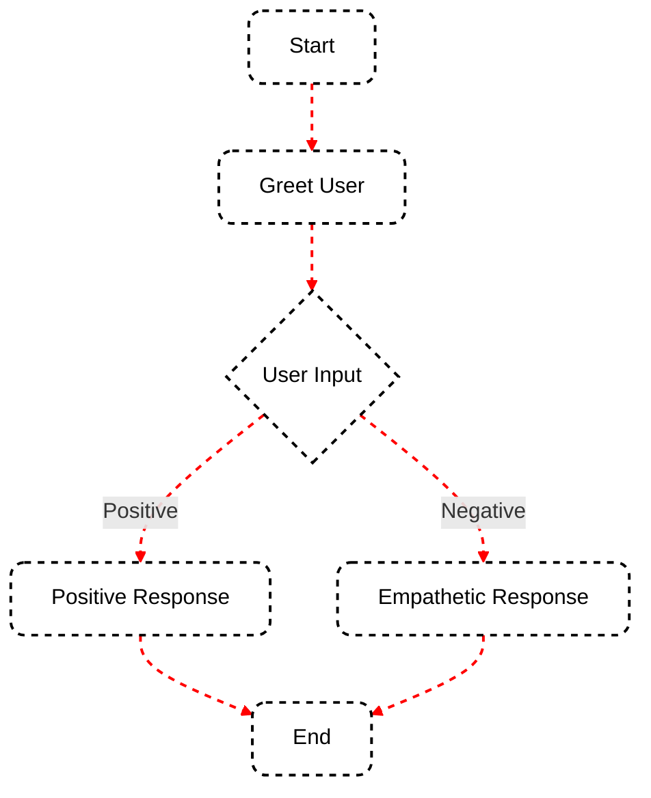

SmartGraph is built on four core concepts: Actors, Tasks, Nodes, and Edges. Understanding these components and how they interact is crucial for creating effective SmartGraph applications.

## Actors: The Doers

Actors are the entities that perform actions within your SmartGraph application. They are responsible for executing tasks and driving the application logic.

SmartGraph provides three primary types of actors:

1. **HumanActor**: Represents a human user interacting with the application.
2. **AIActor**: Represents an AI agent powered by an LLM, capable of processing information and generating responses.
3. **FunctionActor**: Represents a Python function, allowing integration of custom logic into your workflow.

```python
from smartgraph import HumanActor, AIActor

human = HumanActor("User")
ai_assistant = AIActor("AI Assistant", assistant=your_assistant)
```

## Tasks: The Actions

Tasks define the specific actions that actors perform. They encapsulate the instructions or prompts that guide an actor's behavior.

A `Task` object contains:

- `description`: A brief, human-readable description of the task.
- `prompt`: (Optional) A more detailed prompt or instruction for the actor.

```python
from smartgraph import Task

greet_task = Task(description="Greet the user", prompt="Hello! How can I assist you today?")
analyze_task = Task(description="Analyze user data")
```

## Nodes: The Steps

Nodes are the building blocks of your SmartGraph. They represent individual steps or stages within the workflow. Each node is associated with an actor and a task.

```python
from smartgraph import Node

greet_node = Node(id="greet", actor=ai_assistant, task=greet_task)
get_input_node = Node(id="get_input", actor=human, task=Task(description="Get user input"))
```

## Edges: The Connections

Edges define the transitions between nodes, establishing the flow of execution in your SmartGraph. They can have optional conditions to control the flow based on the application state or input data.

```python
from smartgraph import Edge

simple_edge = Edge(source_id="greet", target_id="get_input")
conditional_edge = Edge(
    source_id="analyze",
    target_id="respond",
    condition=lambda data: data['sentiment'] == 'positive'
)
```

## Putting It All Together

Here's a diagram illustrating how these concepts work together in a simple SmartGraph application:



In this diagram:

- Nodes are represented by the boxes (Greet User, User Input, Positive Response, Empathetic Response)
- Edges are the lines connecting the nodes
- The diamond shape represents a decision point, which would be implemented using conditional edges
- Actors (AI and Human) would be associated with each node, determining who performs each action
- Tasks would define what action is performed at each node

By combining these core elements, you can build flexible and intelligent applications that leverage the power of both human and AI actors.

<Card title="Next Steps" icon="arrow-right" href="/essentials/flow">
  Now that you understand the core concepts, learn how to control the flow of
  your SmartGraph application in the [Controlling Flow](/essentials/flow) guide.
</Card>
