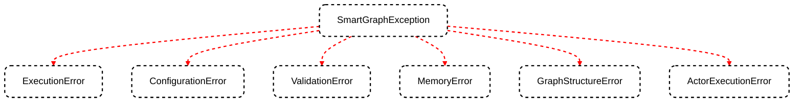

Robust error handling and effective debugging are crucial for building reliable SmartGraph applications. This guide will walk you through SmartGraph's exception hierarchy, error handling techniques, debugging strategies, and the use of logging.

## SmartGraph Exception Hierarchy

SmartGraph uses a custom exception hierarchy to provide more specific error information. Here's an overview:



- **SmartGraphException**: Base exception for all SmartGraph-related errors
- **ExecutionError**: Raised when there's an error during node or workflow execution
- **ConfigurationError**: Indicates issues with SmartGraph configuration
- **ValidationError**: Raised for input or state validation errors
- **MemoryError**: Occurs when there are issues with memory management
- **GraphStructureError**: Indicates problems with the graph structure
- **ActorExecutionError**: Raised when an actor fails to execute a task

## Effective Error Handling

Here are some best practices for handling errors in SmartGraph:

### 1. Use try-except blocks

Wrap potentially error-prone code in try-except blocks:

```python
from smartgraph.exceptions import ExecutionError, ConfigurationError

try:
    result = await graph.execute("start_node", input_data, "session_1")
except ExecutionError as e:
    print(f"Execution failed: {e}")
    # Handle execution error
except ConfigurationError as e:
    print(f"Configuration error: {e}")
    # Handle configuration error
except SmartGraphException as e:
    print(f"An unexpected error occurred: {e}")
    # Handle other SmartGraph errors
```

### 2. Implement error recovery

Design your graph to handle errors gracefully:

```python
def error_recovery_task(input_data, error):
    # Implement error recovery logic
    return {"recovered": True, "original_error": str(error)}

error_recovery_node = Node(
    id="error_recovery",
    actor=FunctionActor("ErrorHandler", error_recovery_task),
    task=Task(description="Handle errors and attempt recovery")
)

# Add error recovery edge
graph.add_edge(Edge(source_id="main_task", target_id="error_recovery", condition=lambda data: "error" in data))
```

### 3. Use conditional edges for error handling

Utilize conditional edges to route execution based on error states:

```python
def is_error(data):
    return data.get("status") == "error"

graph.add_edge(Edge(source_id="task_node", target_id="error_handler_node", condition=is_error))
graph.add_edge(Edge(source_id="task_node", target_id="success_node", condition=lambda data: not is_error(data)))
```

## Debugging Strategies

To effectively debug SmartGraph applications:

1. **Use logging extensively**: Add log statements to track execution flow and state changes.
2. **Leverage checkpoints**: Use SmartGraph's checkpointing feature to pause execution and inspect state.
3. **Visualize the graph**: Use `graph.draw_graph()` to visualize your graph structure and identify issues.
4. **Unit test actors and nodes**: Write unit tests for individual components to isolate issues.
5. **Use a debugger**: Set breakpoints in your code and use a Python debugger to step through execution.

## Logging with SmartGraphLogger

SmartGraph provides a built-in logging system through the `SmartGraphLogger` class. Here's how to use it:

```python
from smartgraph.logging import SmartGraphLogger

logger = SmartGraphLogger.get_logger()

# Log at different levels
logger.debug("Detailed debug information")
logger.info("General information")
logger.warning("Warning message")
logger.error("Error message")
logger.critical("Critical error message")

# Configure logging level
logger.set_level("DEBUG")

# Add a file handler
logger.add_file_handler("smartgraph.log", "INFO")
```

### Best Practices for Logging

1. **Log important events**: Record significant actions, state changes, and decision points.
2. **Include context**: Log relevant data to help understand the application state.
3. **Use appropriate log levels**: Use debug for detailed information, info for general tracking, warning for potential issues, and error/critical for serious problems.
4. **Don't log sensitive information**: Avoid logging passwords, API keys, or other sensitive data.

## Debugging Example: Tracing Execution Flow

Here's an example of how to use logging to trace the execution flow of your SmartGraph application:

```python
from smartgraph import SmartGraph, Node, Edge, HumanActor, AIActor, Task
from smartgraph.logging import SmartGraphLogger

logger = SmartGraphLogger.get_logger()
logger.set_level("DEBUG")

class TracedAIActor(AIActor):
    async def perform_task(self, task, input_data, state):
        logger.debug(f"AIActor '{self.name}' starting task: {task.description}")
        logger.debug(f"Input data: {input_data}")
        logger.debug(f"Current state: {state}")

        result = await super().perform_task(task, input_data, state)

        logger.debug(f"AIActor '{self.name}' completed task. Result: {result}")
        return result

# Create your graph with traced actors
graph = SmartGraph()
ai_actor = TracedAIActor("DebugAI", assistant=your_assistant)
# ... add nodes and edges ...

# Execute the graph
try:
    final_output, should_exit = await graph.execute("start_node", input_data, "debug_session")
    logger.info(f"Graph execution completed. Final output: {final_output}")
except SmartGraphException as e:
    logger.error(f"Graph execution failed: {e}")
```

This example demonstrates how to use logging to trace the execution flow, input/output of tasks, and any errors that occur during graph execution.

## Conclusion

Effective error handling and debugging are essential for building robust SmartGraph applications. By leveraging SmartGraph's exception hierarchy, implementing proper error handling techniques, and utilizing the `SmartGraphLogger`, you can create more reliable and maintainable AI-driven workflows.

<Card title="Next Steps" icon="arrow-right" href="/advanced/performance">
  Learn how to optimize your SmartGraph applications for performance in the
  [Performance Optimization](/advanced/performance) guide.
</Card>
