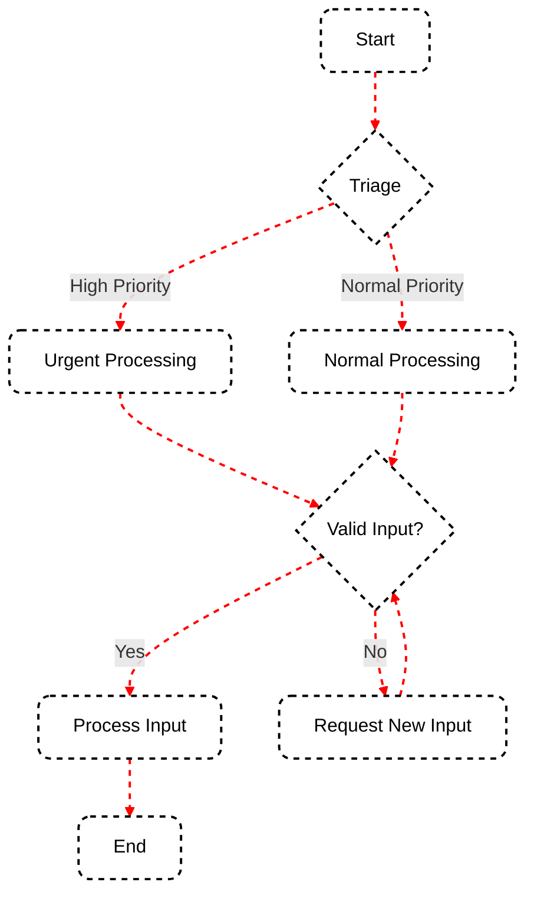

Understanding how to control the flow of execution in your SmartGraph applications is crucial for building dynamic and responsive AI-driven workflows. This guide focuses on using edges and conditional logic to define transitions between nodes and implement decision-making processes.

## Basic Edge Creation

Edges in SmartGraph define the possible transitions between nodes. Here's how to create a simple edge:

```python
from smartgraph import Edge

# Create an edge from node_a to node_b
edge = Edge(source_id="node_a", target_id="node_b")

# Add the edge to your graph
graph.add_edge(edge)
```

This creates a direct, unconditional transition from `node_a` to `node_b`.

## Conditional Edges

Conditional edges allow you to implement dynamic branching based on the current state or output of a node. To create a conditional edge, you need to define a condition function:

```python
def is_high_priority(data):
    return data.get('priority', 0) > 7

high_priority_edge = Edge(
    source_id="triage",
    target_id="urgent_processing",
    condition=is_high_priority
)

normal_priority_edge = Edge(
    source_id="triage",
    target_id="normal_processing",
    condition=lambda data: not is_high_priority(data)
)

graph.add_edge(high_priority_edge)
graph.add_edge(normal_priority_edge)
```

In this example, the workflow will branch based on the priority level of the task.

## Types of Conditions

You can use various types of conditions to control the flow of your SmartGraph application:

### 1. Data-Based Conditions

These conditions evaluate the data passed between nodes:

```python
def is_valid_input(data):
    return 'user_input' in data and len(data['user_input']) > 0

validation_edge = Edge(
    source_id="get_input",
    target_id="process_input",
    condition=is_valid_input
)

retry_edge = Edge(
    source_id="get_input",
    target_id="request_input",
    condition=lambda data: not is_valid_input(data)
)
```

### 2. State-Based Conditions

These conditions check the current state of the application or specific nodes:

```python
def has_sufficient_balance(data):
    return data.get('account_balance', 0) >= 100

process_transaction_edge = Edge(
    source_id="check_balance",
    target_id="process_transaction",
    condition=has_sufficient_balance
)

insufficient_funds_edge = Edge(
    source_id="check_balance",
    target_id="display_error",
    condition=lambda data: not has_sufficient_balance(data)
)
```

### 3. Complex Conditions

You can combine multiple conditions for more complex decision-making:

```python
def is_eligible_for_discount(data):
    return (
        data.get('customer_type') == 'loyal' and
        data.get('purchase_amount', 0) > 500 and
        data.get('has_coupon', False)
    )

apply_discount_edge = Edge(
    source_id="evaluate_purchase",
    target_id="apply_discount",
    condition=is_eligible_for_discount
)

normal_checkout_edge = Edge(
    source_id="evaluate_purchase",
    target_id="normal_checkout",
    condition=lambda data: not is_eligible_for_discount(data)
)
```

## Visualizing Flow Control

Here's a diagram illustrating flow control in a simple SmartGraph application:



This diagram shows how conditional edges can create branching logic and loops in your workflow.

## Best Practices for Flow Control

1. **Keep conditions simple**: Try to make each condition check for a single, clear criterion.
2. **Use meaningful names**: Give your edges and condition functions descriptive names that reflect their purpose.
3. **Handle all cases**: Ensure that you have edges to handle all possible outcomes of a condition.
4. **Avoid circular dependencies**: Be careful not to create infinite loops in your graph structure.
5. **Document complex flows**: For complicated workflows, consider creating a diagram or detailed documentation to explain the flow logic.

## Conclusion

Mastering flow control in SmartGraph allows you to create dynamic, responsive AI applications that can adapt to various inputs and states. By effectively using edges and conditional logic, you can build sophisticated workflows that make intelligent decisions based on data and application state.

Remember that while powerful, complex flow control can also make your application harder to understand and maintain. Strive for a balance between flexibility and simplicity in your graph structure.

<Card title="Next Steps" icon="arrow-right" href="/essentials/state">
  Learn how to manage and persist application state in the [State
  Management](/essentials/state) guide.
</Card>
