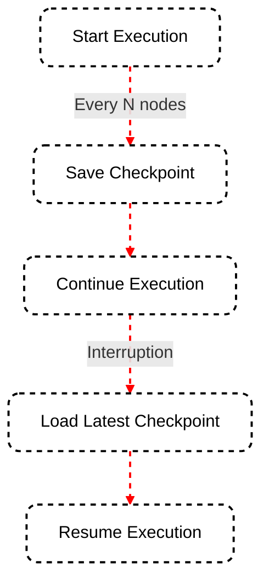

Persistence is crucial for building applications that can maintain context over time, resume interrupted workflows, and provide personalized experiences. SmartGraph offers built-in support for persistence through its checkpointing mechanism.

## Understanding Persistence in SmartGraph

SmartGraph's persistence capabilities allow you to:

- Save the state of your application at specific points in time
- Restore the application state from a previous checkpoint
- Create long-running conversations that can span multiple sessions
- Implement robust error recovery mechanisms

## The CheckpointManager

At the heart of SmartGraph's persistence system is the `CheckpointManager`. This component is responsible for saving and loading checkpoints, which represent snapshots of your application's state.

### How Checkpointing Works



## Configuring Checkpoint Frequency

You can control how often checkpoints are saved by setting the `checkpoint_frequency` parameter when creating your `SmartGraph` instance:

```python
graph = SmartGraph(checkpoint_frequency=10)  # Save a checkpoint every 10 nodes
```

The default frequency is 5 nodes. Adjust this value based on the complexity and duration of your workflow. More frequent checkpoints provide better resilience against interruptions but might incur a slight performance overhead.

## Saving and Loading Checkpoints

SmartGraph handles checkpoint saving and loading automatically during graph execution. However, you can also manually trigger these operations if needed:

```python
# Manually save a checkpoint
await graph.checkpoint_manager.save_checkpoint(thread_id, checkpoint)

# Load the latest checkpoint
latest_checkpoint = await graph.checkpoint_manager.get_latest_checkpoint(thread_id)
```

## Best Practices for Managing Checkpoints

To make the most of SmartGraph's persistence capabilities, consider the following best practices:

<CardGroup cols={2}>
  <Card title="Optimize Frequency" icon="clock">
    Balance checkpoint frequency with performance needs. More frequent
    checkpoints increase resilience but may impact speed.
  </Card>
  <Card title="Clean Up Regularly" icon="broom">
    Implement a strategy to remove old or unnecessary checkpoints to manage
    storage efficiently.
  </Card>
  <Card title="Validate Checkpoints" icon="check-double">
    Periodically verify the integrity of saved checkpoints to ensure they can be
    successfully restored.
  </Card>
  <Card title="Version Your Checkpoints" icon="code-branch">
    If your application structure changes, ensure checkpoint compatibility or
    implement a migration strategy.
  </Card>
</CardGroup>

## Error Handling and Recovery

Implement robust error handling around checkpoint operations:

```python
try:
    latest_checkpoint = await graph.checkpoint_manager.get_latest_checkpoint(thread_id)
    # Restore state from the checkpoint
except Exception as e:
    logger.error(f"Failed to load checkpoint: {e}")
    # Implement fallback logic or start from a clean state
```

## Conclusion

Effective use of SmartGraph's persistence capabilities can significantly enhance the robustness and user experience of your applications. By leveraging checkpoints, you can create long-running, stateful workflows that can survive interruptions and provide personalized interactions over time.

<Card title="Next Steps" icon="arrow-right" href="/essentials/assistants">
  Now that you understand how to manage application state, learn about
  integrating AI assistants in the [AI Assistants](/essentials/assistants)
  guide.
</Card>
