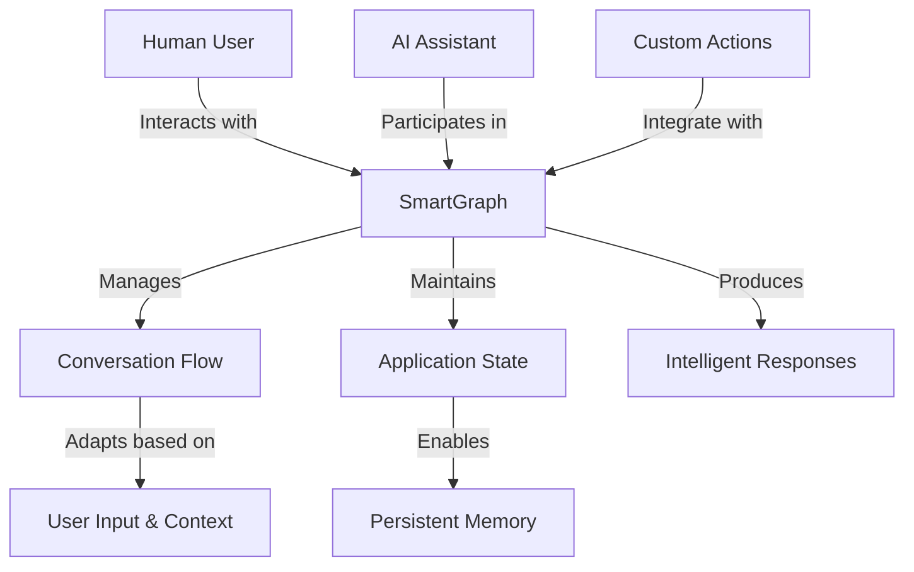

## Understanding SmartGraph: A Visual Overview



The diagram above provides a simplified visual representation of SmartGraph and its key components. Here's what it illustrates:

1. **Central Role of SmartGraph**: At the core of the diagram is SmartGraph, which acts as the central orchestrator for all interactions and processes.

2. **Multiple Actors**: The diagram shows that both Human Users and AI Assistants interact with SmartGraph. This represents the multi-actor nature of SmartGraph applications, where humans and AI can collaborate and communicate.

3. **Custom Actions**: The inclusion of Custom Actions demonstrates that SmartGraph can be extended with specialized functionalities, allowing for integration with external systems or implementation of complex logic.

4. **Conversation Flow**: SmartGraph manages the flow of conversation, which adapts based on user input and context. This illustrates the dynamic and responsive nature of SmartGraph applications.

5. **State Management**: The diagram shows that SmartGraph maintains Application State, enabling Persistent Memory. This means that information can be remembered and utilized across multiple interactions or sessions.

6. **Intelligent Outputs**: The end result of SmartGraph's processes is the production of Intelligent Responses, showcasing the system's ability to generate contextually relevant and intelligent outputs.

This visual representation encapsulates the key strengths of SmartGraph: its ability to facilitate human-AI interaction, manage complex conversational flows, maintain state, and produce intelligent responses - all while offering the flexibility to integrate custom functionalities.

## SmartGraph: Bridging AI and Human Intelligence

SmartGraph is inspired by LangGraph and leverages the powerful capabilities of NetworkX for graph operations. Developed by Waveup Digital, a startup focused on creating a new breed of intelligent systems, SmartGraph embodies the philosophy of **combining the best of AI and human skills**.

This approach aligns perfectly with the multi-actor architecture illustrated in our diagram, where human users and AI assistants collaborate seamlessly.
By enabling the creation of "smarts" - a new type of application that harmoniously blends human expertise with AI capabilities - SmartGraph represents a significant step forward in building more intelligent, adaptive, and human-centric systems.

The framework's emphasis on customizable workflows, persistent memory, and dynamic interactions makes it an ideal tool for developing applications that truly augment human intelligence with AI, rather than simply automating tasks.

## Why SmartGraph?

Building applications with LLMs often involves managing complex conversations, user preferences, and dynamic decision-making processes. SmartGraph simplifies this process by:

1. **Representing Application Logic Visually:** SmartGraph uses a directed graph structure, making it easier to understand and modify the flow of your application.

2. **Seamless State Management:** The library handles state persistence automatically, allowing you to focus on defining the interactions between actors without worrying about the underlying complexities of state management.

3. **Enabling Dynamic Branching and Conditional Logic:** Create more engaging and responsive applications that adapt to user input and application state using conditional edges and custom logic.

4. **Integrating Multiple Actor Types:** Easily combine interactions between human users, AI assistants, and custom Python functions within a single, cohesive workflow.

5. **Providing Built-in Persistence and Checkpointing:** Automatically save and restore application state, enabling long-running conversations and multi-session interactions.

## Key Features

1. **Stateful Interactions:** Maintain and manage state throughout the application lifecycle, enabling persistent conversations and complex workflows.

2. **Multi-Actor Architecture:** Define interactions between multiple actors:

   - Human users for input and feedback
   - AI assistants powered by libraries like `phi` for intelligent responses
   - Custom Python functions for specialized tasks and integrations

3. **Graph-Based Workflow:** Represent your application logic visually and intuitively using a directed graph, where:

   - Nodes represent tasks or decision points
   - Edges define transitions between nodes

4. **Conditional Logic and Branching:** Define conditions on edges to control the flow of execution based on data and state, enabling dynamic and responsive applications.

5. **Built-in Memory Management:** Leverage short-term and long-term memory components to store and retrieve information, enabling context-aware AI interactions.

6. **Checkpointing and Persistence:** Automatically save and restore application state, allowing for long-running conversations and multi-session interactions.

7. **Error Handling and Logging:** Utilize SmartGraph's robust error handling system and comprehensive logging capabilities to debug and monitor your applications effectively.

8. **Extensibility:** Easily create custom actors and actions to integrate with external systems or implement specialized logic.

## Getting Started

### Installation

Install SmartGraph using pip:

```bash
pip install smartgraph
```

### Basic Example

Here's a minimal example to illustrate SmartGraph's core concepts:

```python
from smartgraph import SmartGraph, Node, Edge, HumanActor, AIActor, Task
from phi.assistant import Assistant
from phi.llm.openai import GPT35Turbo

# Initialize OpenAI assistant
assistant = Assistant(llm=GPT35Turbo(api_key="YOUR_OPENAI_API_KEY"))

# Create actors
human = HumanActor("User")
ai = AIActor("AI", assistant=assistant)

# Define tasks
greet_task = Task(description="Greet the user", prompt="Hello! How can I help you today?")
respond_task = Task(description="Respond to the user", prompt="{input[user_message]}")

# Create nodes
greet_node = Node(id="greet", actor=ai, task=greet_task)
get_user_message_node = Node(id="get_user_message", actor=human, task=Task(description="Get user message"))
respond_node = Node(id="respond", actor=ai, task=respond_task)

# Construct the graph
graph = SmartGraph()
graph.add_node(greet_node)
graph.add_node(get_user_message_node)
graph.add_node(respond_node)

# Connect nodes with edges
graph.add_edge(Edge(source_id="greet", target_id="get_user_message"))
graph.add_edge(Edge(source_id="get_user_message", target_id="respond"))
graph.add_edge(Edge(source_id="respond", target_id="get_user_message"))

# Execute the graph
final_output, should_exit = graph.execute("greet", {}, "conversation_1")
print("Final output:", final_output)
```

This example demonstrates a simple conversational flow where an AI assistant greets the user, gets their message, and responds accordingly.

## Next Steps

To dive deeper into SmartGraph's capabilities and learn how to build more complex applications, check out the following sections:

- [Core Concepts](./essentials/concepts): Learn about the fundamental building blocks of SmartGraph.
- [Controlling Flow](./essentials/flow): Discover how to create dynamic workflows using edges and conditional logic.
- [State Management](./essentials/state): Understand how to manage and persist application state.
- [AI Assistants](./essentials/assistants): Learn how to integrate and leverage AI assistants in your SmartGraph applications.
- [Custom Actors and Actions](./essentials/custom-actors): Explore how to extend SmartGraph with your own specialized components.

By mastering these concepts, you'll be well-equipped to create powerful, intelligent applications using SmartGraph.
