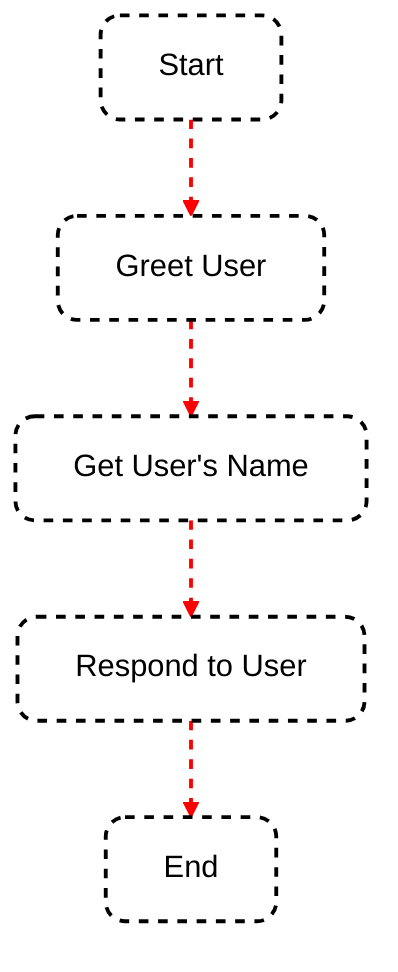

Welcome to the SmartGraph quickstart guide! This tutorial will walk you through creating a simple conversational application using SmartGraph.

## Installation

<Steps>
  <Step title="Install SmartGraph">
    Use pip to install SmartGraph and its dependencies:

    ```bash
    pip install smartgraph
    ```

  </Step>
  <Step title="Install an LLM library">
    SmartGraph works with various LLM libraries. For this example, we'll use `phidata`:

    ```bash
    pip install phidata
    ```

  </Step>
</Steps>

## Creating Your First SmartGraph Application

Let's create a simple conversational app that greets the user, asks for their name, and responds.

<Steps>
  <Step title="Import necessary modules">
    ```python
    from smartgraph import SmartGraph, Node, Edge, HumanActor, AIActor, Task
    from phi.assistant import Assistant
    from phi.llm.openai import GPT35Turbo
    ```
  </Step>
  <Step title="Set up the AI assistant">
    ```python
    assistant = Assistant(llm=GPT35Turbo(api_key="YOUR_OPENAI_API_KEY"))
    ```
    <Callout type="warning">
      Remember to replace "YOUR_OPENAI_API_KEY" with your actual OpenAI API key.
    </Callout>
  </Step>
  <Step title="Create actors and tasks">
    ```python
    human = HumanActor("User")
    ai = AIActor("AI", assistant=assistant)

    greet_task = Task(description="Greet the user", prompt="Hello! What's your name?")
    respond_task = Task(description="Respond to the user",
                        prompt="Nice to meet you, {input[user_name]}! How can I assist you today?")
    ```

  </Step>
  <Step title="Create nodes">
    ```python
    greet_node = Node(id="greet", actor=ai, task=greet_task)
    get_name_node = Node(id="get_name", actor=human, task=Task(description="Get user's name"))
    respond_node = Node(id="respond", actor=ai, task=respond_task)
    ```
  </Step>
  <Step title="Construct the graph">
    ```python
    graph = SmartGraph()
    for node in [greet_node, get_name_node, respond_node]:
        graph.add_node(node)

    graph.add_edge(Edge(source_id="greet", target_id="get_name"))
    graph.add_edge(Edge(source_id="get_name", target_id="respond"))
    ```

  </Step>
  <Step title="Execute the graph">
    ```python
    final_output, should_exit = graph.execute("greet", {}, "conversation_1")
    print("Final output:", final_output)
    ```
  </Step>
</Steps>

## Understanding the Flow

Here's a simple diagram illustrating the flow of our quickstart application:



Next Steps
Now that you've created your first SmartGraph application, you can explore more advanced features:

<CardGroup cols={2}>
  <Card title="Custom Actors" icon="user-gear" href="/essentials/custom-actors">
    Create specialized actors for complex tasks
  </Card>
  <Card title="Conditional Edges" icon="code-branch" href="/essentials/flow">
    Add branching logic to your conversation flow
  </Card>
  <Card title="State Management" icon="database" href="/essentials/state">
    Utilize short-term and long-term memory
  </Card>
  <Card title="Error Handling" icon="bug" href="/essentials/debugging">
    Implement robust error handling and logging
  </Card>
</CardGroup>
For more detailed information on these topics and more, check out our section `essentials`.
